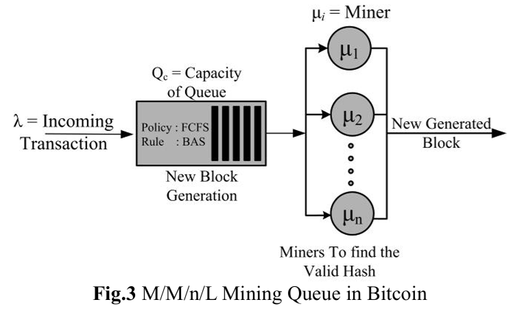
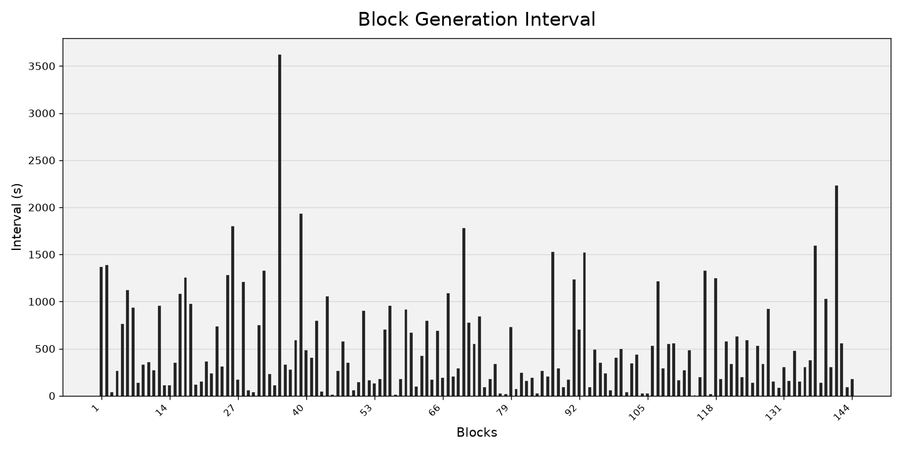
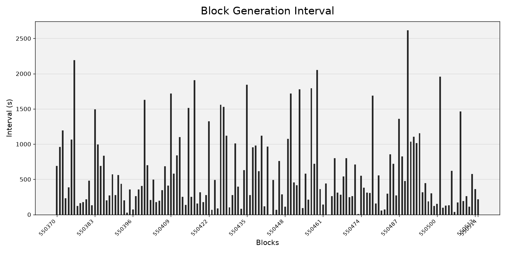
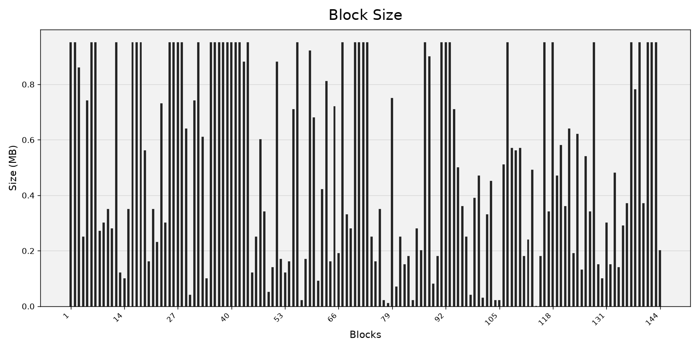
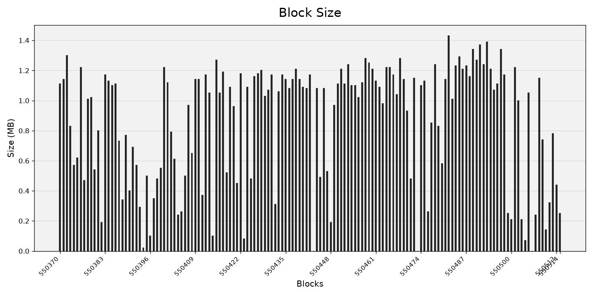
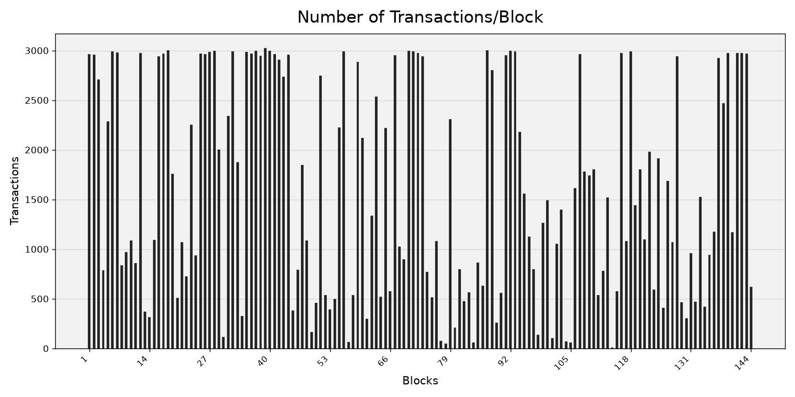
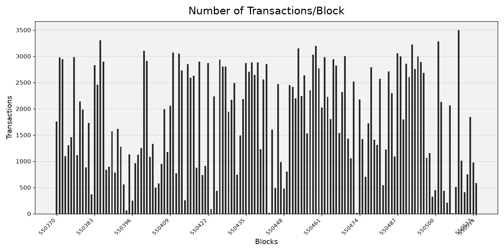

# Introduction to Blockchain and Its Applications Bonus Project

TOPIC: 基於離散事件模擬之比特幣 PoW 共識機制與 Mempool 壅塞動態分析  
M11415080 蔡翔宇

## 1. 前言

本模擬器原本為 *CS5068701計算機模擬* 課程之期末專案開發使用。為了契合本區塊鏈課程的評分精神，我將針對該模擬器產出的數據，重新撰寫一份專注於「區塊鏈物理機制探討（如網路壅塞、空區塊現象）」的分析報告，並進一步修改該模擬器使其更為接近真實比特幣系統。  

在嘗試復現 MODELING OF BLOCKCHAIN BASED SYSTEMS USING QUEUING THEORY SIMULATION 這篇論文時，作者設定的模型與真實比特幣系統運作相去甚遠，且以當日總hash rate平均分配給當日144區塊、再均分給設定的1000個礦工節點作為service time(挖礦時間)顯然不合理。因此我參考真實比特幣系統的PoW共識機制並保留原作者的部分模型設定，設計了一個接近 M/M[Y]/1/L 的佇列批次服務模型。

## 2. 論文內容摘要

目前區塊鏈的發展大多集中在工程實作與應用層面，而針對系統效能評估、參數調整、模型最佳化以及探討參數間關係的「理論性研究」卻非常匱乏。因此，本研究旨在填補這項空白，透過理論模擬來揭示區塊鏈系統運作時最關鍵的特徵與潛在瓶頸。  
挖礦是區塊鏈網路中最耗時、成本最高且最不可或缺的環節。為了能在實際大規模採用該技術前進行效能分析與最佳化，作者擷取了比特幣（Bitcoin）真實網路的單日交易數據，並透過 Java 建模工具（JSIMgraph）建構了一個 M/M/n/L 排隊模型 **(Fig.3)** 來模擬全網礦工處理交易的動態過程，但其設定為將交易分派給1000個礦工處理，而非PoW競爭。  

透過上述的排隊理論模擬，作者致力於獲取並評估以下三個具體的系統效能指標：

1. 單一區塊包含的交易數量
2. 系統生成區塊的時間與吞吐量
3. 礦工資源的利用率

作者最終的目標是期望這個具有真實數據基礎的排隊模型，雖然只模擬了區塊鏈的基本規則，但能夠成功為區塊鏈架構的基礎理論研究與效能分析開啟一個全新的研究方向。

## 3. 模擬器設計、實作及參數設定

### 3.1 模擬器設計

論文中以2018年11月17日當天比特幣網路的真實數據進行模擬。作者在文中提到雖然真實比特幣網路中有數以萬計的礦工節點，但以總算力分配給1000個礦工節點進行模擬對於模擬結果並無影響。經過先前的實驗也確認確實如此，因此本模擬器保留原作者的模型架構，對於運作機制的部分則進行了修改，使其更接近真實比特幣系統的運作。

#### 交易生成機制

交易生成採用 Poisson 過程，交易大小則以三個常態分布的混合模型來模擬，分別為：

1. 45% 的交易為SegWit (Native Witness) 單輸入、雙輸出交易  
   大小服從 **N(220, 152)** 的常態分布
2. 40% 的交易為較舊式的 Legacy (P2PKH) 標準交易  
   大小服從 **N(350, 302)** 的常態分布
3. 15% 的交易為雙輸入、雙輸出（2 Inputs, 2 Outputs）的 SegWit 交易  
   大小服從 **N(650, 1002)** 的常態分布

並且以2018年11月17日當天比特幣網路的真實數據 271,921 筆交易來設定交易生成的平均間隔秒數為 **0.3177 秒**。

#### Waiting Queue (Mempool)

- 採用 FCFS 的佇列機制，且以交易大小 (vB) 為基礎來限制 mempool 的容量與區塊的打包上限。當交易到達時，如果 mempool 已滿則直接丟棄該交易。
- Mempool 的容量上限設定為 300,000,000 vB，以模擬比特幣官方核心用戶端（Bitcoin Core）所設定的預設 Mempool（記憶池）容量上限 300 MB。

#### 區塊打包機制

- 區塊打包機制採用批次服務 (Batch Service)，每當有礦工完成挖礦並生成區塊後，該區塊會從 mempool 中打包交易直到達到區塊打包上限為止。
- 每個區塊的打包上限設定為 1,000,000 vB，以模擬比特幣系統中每個區塊的最大容量上限 1 MB。
- 當目前區塊已打包的交易總大小加上下一筆交易的大小超過區塊打包上限時，該交易將不會被打包進當前區塊，而是留在 mempool 中等待下一個區塊的打包。
- 當區塊生成完成後，已打包的交易將從 mempool 中移除，並且 mempool 的目前大小也會相應減少。
- 為求模擬的簡化與效率，區塊的打包過程中不會考慮交易費用（fee）對交易優先順序的影響，完全以交易大小及到達順序來決定是否能被打包進當前區塊。

#### 挖礦競爭機制

- 比特幣的挖礦競爭機制是基於工作量證明（Proof of Work, PoW）的共識機制，礦工們會不斷嘗試不同的 nonce 值來尋找符合當前難度目標的區塊哈希值。這個過程是一個隨機過程，且每個礦工找到符合條件的區塊的時間服從指數分布。
- 真實比特幣的平均區塊生成時間約為 10 分鐘（600 秒），在模擬器中我們以算力平均分配給1000個礦工節點的方式來設定每個礦工的挖礦時間，因此以指數分布設定每個礦工的平均挖礦時間為 600,000 秒（即 600 秒 * 1000 礦工），以模擬整個網路的平均區塊生成時間為 10 分鐘。

### 3.2 模擬器實作

這是一個離散事件模擬器(Discrete Event Simulator)，核心程式碼以C語言撰寫，主要包含在 `src/mmnl_pow.c` 中，其中包含了模擬器的主要邏輯與運作機制。模擬器的參數設定則是透過 `src/mmnl_pow.in` 這個輸入檔案來進行設定，使用者可以根據需要修改該檔案中的參數值來進行不同情境的模擬。

模擬器的隨機數生成使用了來自 *Simulation Modeling and Analysis* 教科書的線性同餘生成器 (Linear Congruential Generator)，`lcgrand.c` 和 `lcgrand.h` 這兩個檔案，以確保模擬過程中的隨機性與可重現性。

### 3.3 參數設定

綜合以上描述，模擬器的參數設定如下：

| 參數名稱 | 設定值 | 說明 |
| --- | --- | --- |
| mean_interarrival | 0.3177 秒 | 交易到達平均間隔秒數 |
| mean_service_time | 600,000 秒 | 單一礦工每輪競爭完成時間之指數分布平均值 (秒) |
| queue_capacity | 300,000,000 vB | mempool 容量上限 (vB) |
| max_block_size | 1,000,000 vB | 每個區塊可打包交易總大小上限 (vB) |
| Queue Discipline | FCFS | 佇列服務機制 (First-Come, First-Served) |
| Number of Miners | 1000 | 模擬器中礦工節點數量 |
| num_blocks_to_simulate | 144 | 統計區塊數 N (排除暖機期) |
| warmup_blocks | 10 | 暖機期區塊數量 (前10個區塊不納入統計) |

## 4. 模擬結果

平均數據比較:

| 統計指標 | 模擬結果 (平均值) | 真實比特幣網路數據 (2018/11/17) |
| --- | --- | --- |
| 區塊生成間隔 (秒) | 513.58 | 596.41 |
| 區塊大小 (vB) | 0.5187 | 0.8717 |
| 區塊內交易數量 (筆) | 1615.16 | 1811.37 |

每區塊數據分布圖:

| 模擬器輸出數據 (模擬 144 個區塊) | 比特幣網路真實數據 (2018/11/17) |
| --- | --- |
|  |  |
|  |  |
|  |  |

## 5. 結論與未來展望

## 6. 參考文獻

1. [M. A. Ferrag, L. Maglaras, H. Janicke, and J. Jiang, “Modeling of blockchain based systems using queuing theory simulation,” in 2018 IEEE International Conference on Communications (ICC), 2018, pp. 1–6.](https://ieeexplore-ieee.org/document/8632560)
2. [mempool.space](https://mempool.space/)
3. Simulation Modeling and Analysis, 5th Edition, by Averill M. Law, Waveland Press, 2015
